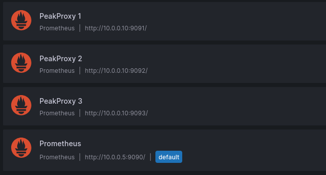

### Demo Dashboard

This dashboard is based on the standard [Node Exporter Full](https://grafana.com/grafana/dashboards/1860-node-exporter-full/) dashboard, but is
heavily cut down/customized to demonstrate the functionality of the `PeakProxy`.

The `PeakProxy`, is a reverse proxy for `Prometheus`, that for an arbitrary
`Prometheues` query, returns time-correlated samples which are determined to
be peaks, in the original samples retrieved from `Prometheus`.

To use the dashboard, import it into `Grafana` and customize the data sources,
to point them to three separate instances of the proxy.

For example, the three separate instances of the `PeakProxy` that are shown
below, all run on host `10.0.0.10`, and all point to a single `Prometheus`
instance running at: `http://10.0.0.5:9090`

The three separate proxy instances all run on their respective ports, i.e.,
port `9091` for the instance that runs only a single iteration, port `9092`
for the instance that runs two iterations, and port `9093` for the instance
that runs three iterations.

#### PeakProxy Instance 1 (Local Port: 9091, Number of iterations: 1)
```sh
❯ ./peakproxy run -p 9091 -t http://10.0.0.5:9090 -i 1

```

#### PeakProxy Instance 2 (Local Port: 9092, Number of iterations: 2)
```sh
❯ ./peakproxy run -p 9092 -t http://10.0.0.5:9090 -i 2

```

#### PeakProxy Instance 3 (Local Port: 9093, Number of iterations: 3)
```sh
❯ ./peakproxy run -p 9093 -t http://10.0.0.5:9090 -i 3

```

### The resulting set of `Grafana` data sources should look like this:

