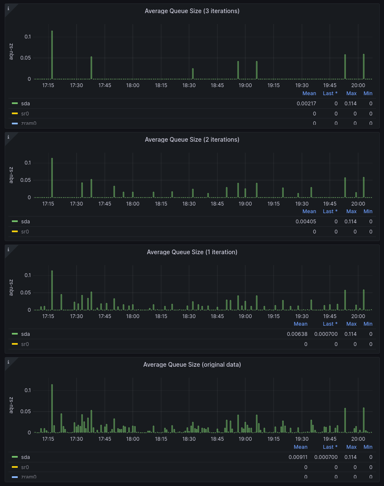

### Peak Detector Reverse Proxy for Prometheus

#### NB: This is not yet production ready. It is still undergoing heavy development and testing.

Based on the [Peak Detector](https://github.com/andr31g/peak-detector) library written in `Golang`.
See the demo dashboard [ReadMe](doc/demo/dashboards/about.md), for additional information about how
this reverse proxy for `Prometheus`, can be used as a data source in `Grafana`.

### Checkout the repository

```sh
❯ git clone https://github.com/andr31g/peak-proxy.git
❯ 
```

### Build the `go` executable

It was tested with `go` version `1.21` and up.

```sh
❯ go build
❯ ls -l
...
-rwxr-xr-x 1 ...  peakproxy
...
❯
```

### Run the Proxy

The proxy will run on local port `9091`, connecting to `Prometheus` located at `http://192.168.0.122:9090`,
with the log level set to `DEBUG`, and the number of iterations set to `1`.

After the proxy is started, create a new `Prometheus` data source in `Grafana`, and point it to the `address:port`
of the running proxy.

```sh
❯ ../peakproxy run -p 9091 -t http://192.168.0.122:9090 -i 1 -l debug
{"time":"2025-01-19T21:22:22.488823666-05:00","level":"INFO","msg":"Log level is set to","log-level":"DEBUG"}
^C
❯
```

### Below is a `Grafana` screenshot of three instances of the proxy

Each instance is configured for different number of iterations.

